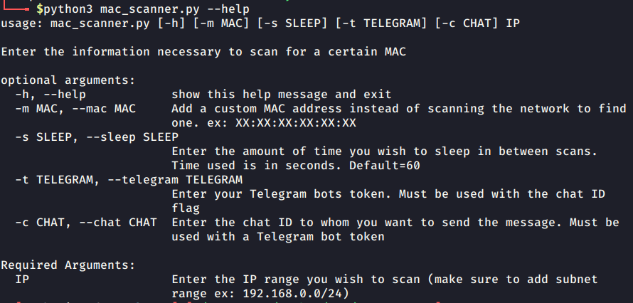

# MAC-Scanner
Scans a network for specified MAC Address. Allows you to keep it running and insert a Telegram bot token + chat ID to sent remote notifications. Useful if you are trying to see if a person/MAC is on your home/local network while away. 

### Installation

mac_scanner.py requires python-nmap, requests, and argparse to run. This can be done by simply cloning the repository and using pip to install the requirements.

```install
$ git clone https://github.com/epthewizard/MAC-Scanner.git
$ cd MAC-Scanner
$ python3 -m venv venv
$ pip3 install -r requirements.txt
```

### Running the Program 

`python3 mac_scanner.py --help`


